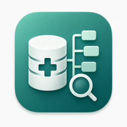

# MedDRA Browser Mac



这是一个本地运行的 MedDRA 浏览器。界面是中文，可以查中文、英文或双语词典。词典文件只在你自己的电脑上读取，不会上传。

本项目不包含 MedDRA 词典数据。请使用你有权使用的 MedDRA 词典文件夹。

## 我该下载哪个文件

在 GitHub Release 里有两个压缩包：

- `meddra-browser-mac-app.zip`：Mac 用户优先用这个。
- `meddra-browser-portable.zip`：Windows 和 Mac 都能用。适合不想安装 App，或想放在 U 盘、移动硬盘里用。

## Mac App 用法

1. 下载 `meddra-browser-mac-app.zip`，解压。
2. 把 `MedDRA Browser Mac.app` 拖到“应用程序”。
3. 双击打开。第一次如果被系统拦截，请右键点 App，选择“打开”。
4. 打开后建议把窗口最大化。
5. 如果系统提示还没有词典，点“设置”里的“选择词典文件夹”。
6. 在 Finder 里选你的 MedDRA 文件夹。可以选 `MedDRA_29_0_Chinese`、`MedDRA_29_0_English`、`MedAscii`、`ascii-290`，也可以选它们的上级文件夹。系统会自己往下找。

选好后就可以搜索。以后再打开 App，一般不用重新选择。

## 便携版用法

解压 `meddra-browser-portable.zip`。里面会看到这些入口文件：

- `【Windows】第一步：请双击我运行.bat`
- `【Mac】第一步：请双击我运行.command`
- `第二步：双击我开始MedDRA浏览.html`
- `请先看我.txt`

Windows：

1. 双击 `【Windows】第一步：请双击我运行.bat`。
2. 等黑色窗口提示服务启动。第一次运行可能会安装依赖，时间会久一点。
3. 双击 `第二步：双击我开始MedDRA浏览.html`。
4. 进入页面后，点“设置”里的“选择词典文件夹”，选择你的 MedDRA 文件夹。

Mac：

1. 双击 `【Mac】第一步：请双击我运行.command`。
2. 如果浏览器没有自动打开，再双击 `第二步：双击我开始MedDRA浏览.html`。
3. 进入页面后，点“设置”里的“选择词典文件夹”，选择你的 MedDRA 文件夹。

便携版打开后会在浏览器里运行。使用时不要急着关闭第一步打开的命令窗口；不用了再关。

## 选择哪个词典文件夹

不用选某一个文件。选文件夹就行。

能选的例子：

- `MedDRA_29_0_Chinese`
- `MedDRA_29_0_English`
- `MedAscii`
- `ascii-290`
- 放着这些文件夹的上一级目录

正常的 MedDRA ASCII 文件夹里通常能看到这些文件：

```text
soc.asc
hlgt.asc
hlt.asc
pt.asc
llt.asc
mdhier.asc
hlt_pt.asc
hlgt_hlt.asc
soc_hlgt.asc
smq_list.asc
smq_content.asc
```

如果你不确定选哪一个，就选更上一级的文件夹。系统会递归查找。

## 常用功能

- 输入 AE/MH 名称或代码搜索术语。
- 默认搜索 PT，也可以勾选 LLT、HLT、HLGT、SOC、SMQ。
- 点击结果后，右侧会显示父级和子级关系树。
- 可以把条目加入 Research Bin，再导出。
- 可以切换中文、英文、双语显示。
- 手机上会提示使用电脑端。这个工具主要给电脑大屏使用。

## 常见问题

### 打开后说没有词典

进入“设置”，点“选择词典文件夹”，重新选择 MedDRA 文件夹。

### Windows 第一次运行很慢

第一次会准备 Python 运行环境并安装依赖。等它跑完，不要关窗口。

### Mac 提示无法打开 App

右键点 App，选择“打开”。如果仍然打不开，请确认电脑上有 `python3`。

### 我能把词典发给别人吗

本项目不包含词典，也不处理 MedDRA 授权。词典怎么使用、能不能转发，请按你自己的 MedDRA 授权要求处理。

## 给开发者

本项目使用 FastAPI、SQLite FTS5、Vite、React 和 TypeScript。

常用命令：

```bash
cd frontend
npm install
npm run build
```

```bash
PYTHONPATH=backend python3 -m unittest discover -s backend/tests -v
```

本地启动：

```bash
./scripts/start_meddra_server.sh
open http://127.0.0.1:8765/
```

打包：

```bash
./scripts/build_macos_app.sh "/Applications/MedDRA Browser Mac.app"
./scripts/build_portable_package.sh
```

浏览器 smoke 测试：

```bash
MEDDRA_BROWSER_URL=http://127.0.0.1:8765/ python3 scripts/playwright_smoke.py
```

发布包不应包含 MedDRA 原始数据、SQLite 缓存、`pyc` 文件或本机路径。

## License

This repository is source-available for personal, non-commercial use under `LICENSE.md`.

MedDRA dictionary data is not included. MedDRA data use is governed by the relevant MedDRA/MSSO/ICH license terms.

## English quick start

Download `meddra-browser-mac-app.zip` for Mac, or `meddra-browser-portable.zip` for Windows/Mac portable use.

Mac App: unzip, move the app to Applications, open it, then choose your MedDRA dictionary folder from Settings.

Portable package: run the step 1 launcher for your operating system, then open `第二步：双击我开始MedDRA浏览.html`. If no dictionary is loaded, use Settings to select a MedDRA release folder, a `MedAscii` folder, an `ascii-*` folder, or their parent folder.
